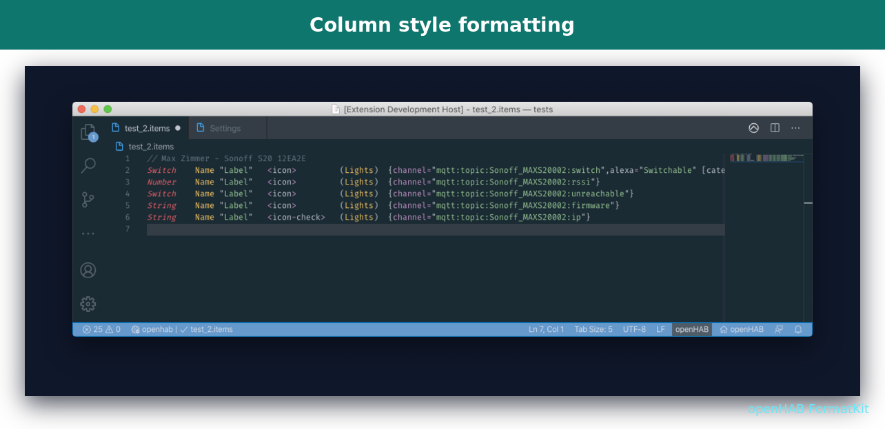
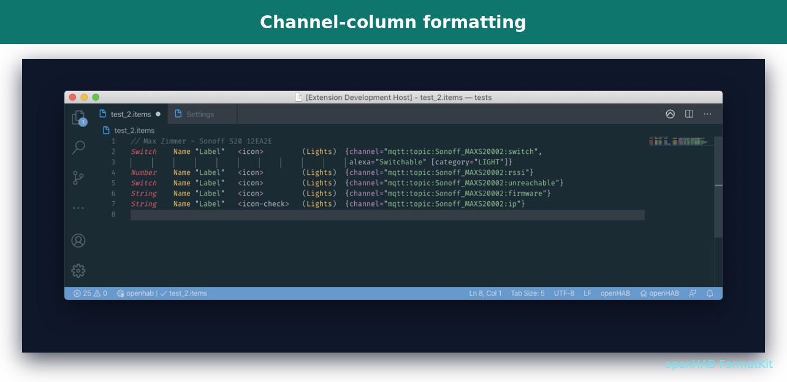
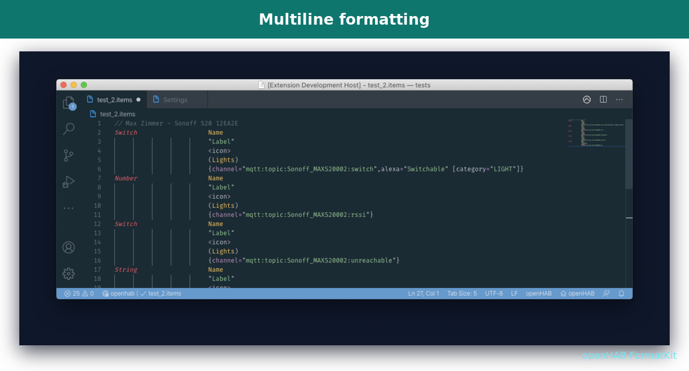
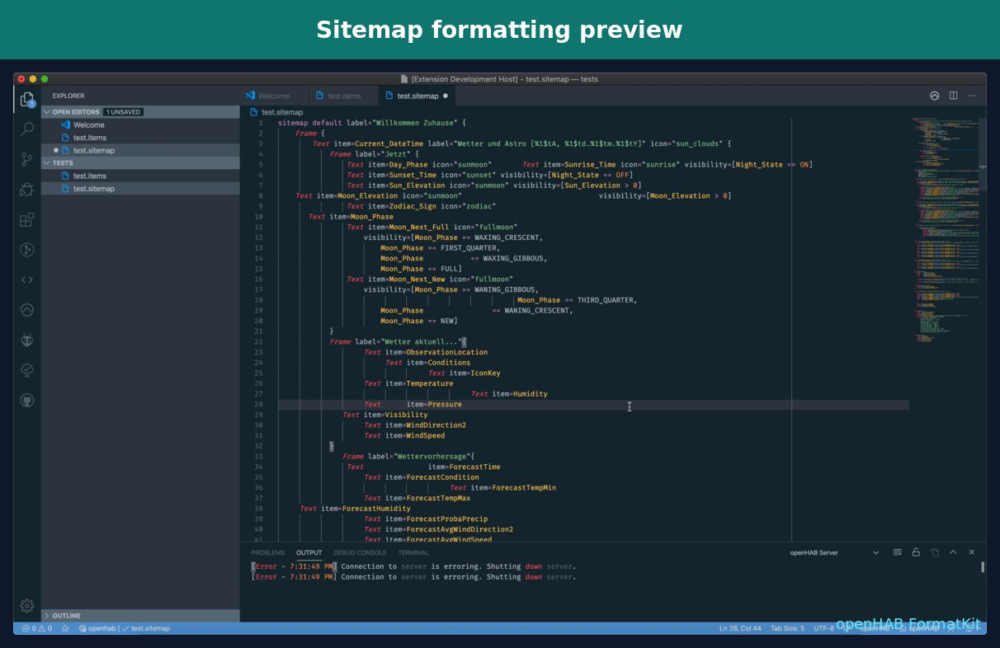
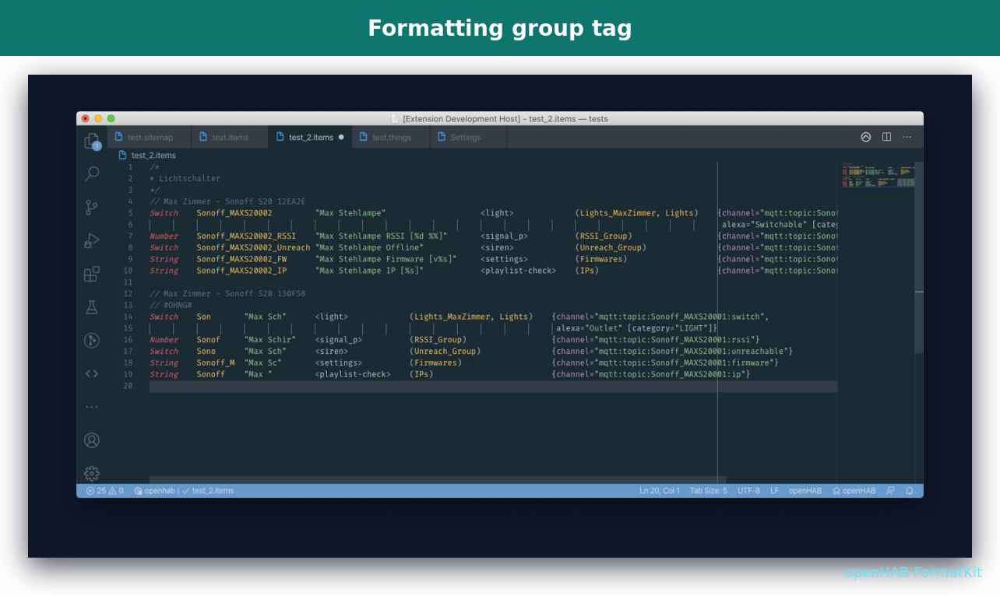
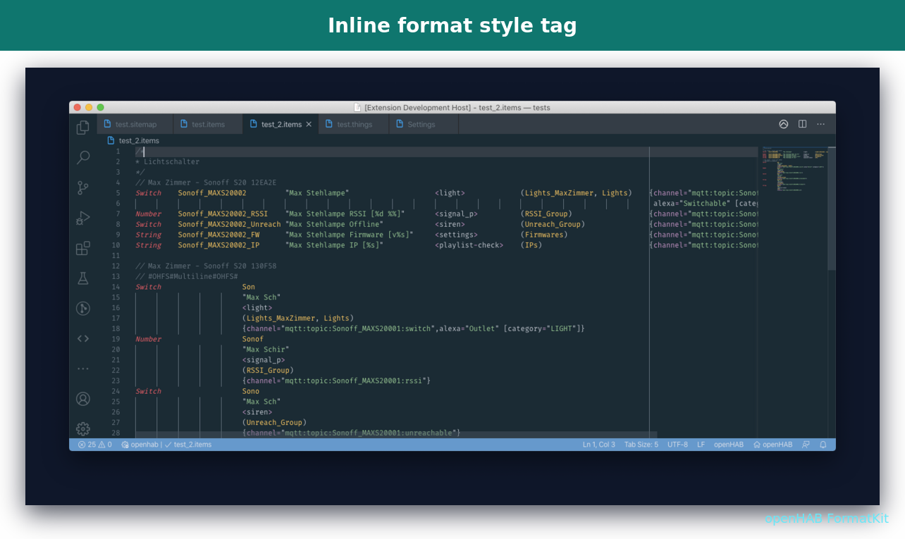

<div align="center">
  
</div>

# openHAB FormatKit

openHAB FormatKit is an independently maintained Visual Studio Code extension for formatting, syntax highlighting, snippets, code suggestions, and a local outline tree for openHAB configuration files such as `.items`, `.rules`, `.sitemap`, `.script`, `.things`, and `.persist` files.

This is an independently maintained project. It is **not affiliated with, endorsed by, or published by** the original `openHAB Alignment Tool` author or project. The codebase began as a maintained fork of the inactive open-source project by Maximilian Beckenbauer, and that origin is credited here for transparency. All marketplace branding, icon artwork, package identity, README wording, and command/settings namespace have been changed for this independent release.

## What changed for the independent release

- Extension display name changed to **openHAB FormatKit**.
- Marketplace package ID changed to `openhab-formatkit` under the existing publisher account.
- Extension icon and README wordmark replaced with newly created artwork under `images/formatkit-*`.
- Commands and settings moved to the `openhab-formatkit.*` namespace.
- README and extension messaging rewritten to make the independent maintenance status clear.
- Attribution to the original open-source project is kept without implying affiliation or endorsement.

## Features

The extension uses the standard Visual Studio Code formatter API. You can format files with **Format Document**, **Format Selection**, or VS Code's format-on-save setting.

It also contributes openHAB DSL syntax highlighting, snippets, code suggestions, and a local outline tree for common textual configuration files.

Supported formatting styles for openHAB item files:

- Column style
- Channel-column style
- Multiline style

Supported openHAB file types:

- `.items` — column formatter, syntax highlighting, snippets, suggestions, local outline
- `.sitemap` — beta formatter, syntax highlighting, snippets, suggestions, local outline
- `.things` — structured indentation formatter with `Type` / `State` / implicit state / `Trigger` channel alignment, syntax highlighting, suggestions, local outline
- `.rules` — structured indentation formatter, syntax highlighting, snippets, suggestions, local outline
- `.script` — structured indentation formatter, syntax highlighting, suggestions, local outline
- `.persist` — syntax highlighting, suggestions, local outline
- `transform/*.map`, `transform/*.scale` — local transformation suggestions
- `services/*.cfg` — local service/add-on/runtime suggestions

### Item formatting examples

**Column style**



**Column-channel style**



**Multiline style**



**Sitemap formatting**



## Maintained fixes

This maintained version includes fixes for openHAB item channel binding configurations where curly braces inside quoted strings could break formatting. Example affected cases are channel parameters that contain JSON-like values or text with `{...}` inside quotes.

It also corrects space-based column padding when `editor.insertSpaces` is enabled, so aligned columns stay consistent with the configured tab size.

Group aggregation functions with regex parameters are preserved correctly, for example:

```text
Group:Number:COUNT(.*) gL_gO_gGd_gMain_Appliances_Count <appliances> (gL_gO_gGd_gMain_Appliance)
```

The formatter keeps `Group:Number:COUNT(.*)` intact instead of misreading `COUNT` as a `Number` subtype.

## Code suggestions

FormatKit contributes local VS Code completion suggestions for openHAB textual configuration files. These suggestions are static and file-based, so they do not require an openHAB REST connection.

Included suggestions cover:

- `.items` — Item types, common `Number:<dimension>` examples, Group aggregation functions, Item and channel-link snippets
- `.things` — `Bridge`, `Thing`, `Channels`, `Type`, `State`, implicit state, and `Trigger` channel snippets
- `.rules` / `.script` — rule skeletons, Item/Member/Time/System/Thing/Channel trigger snippets, common Actions such as `sendCommand`, `postUpdate`, and `createTimer`
- `.sitemap` — Sitemap element keywords and common widget snippets
- `.persist` — `Strategies`, `Filters`, `Items`, `Aliases`, predefined strategies, and section snippets
- `transform/*.map`, `transform/*.scale` — MAP entries, SCALE ranges, common openHAB states, and transformation usage helpers
- `services/*.cfg` — `addons.cfg` package/binding/UI/persistence/transformation snippets plus `runtime.cfg` audio/voice defaults
- Item/Sitemap label helpers — common transformation expressions such as `MAP(...)`, `SCALE(...)`, `JS(...)`, `JSONPATH(...)`, `REGEX(...)`
- Item/Sitemap icon helpers — common openHAB classic icon names
- Rules multimedia helpers — audio/voice actions such as `playSound`, `playStream`, `say`, `interpret`, and volume helpers

## Local outline tree

FormatKit adds an **openHAB FormatKit** activity-bar view with a local outline for the active openHAB file.

The outline is file-based and does not require an openHAB REST connection:

- `.items` — lists Items, including complex Group types such as `Group:Number:COUNT(.*)`
- `.rules` / `.script` — lists rules, imports, and global `val` / `var` declarations
- `.things` — lists Bridges, Things, and `Type` / `State` / implicit state / `Trigger` Channels
- `.sitemap` — lists sitemap elements such as Frames, Groups, Switches, Buttongrids, Buttons, Inputs, Text entries, etc.
- `.persist` — lists Strategies, Filters, Items, and Aliases

Clicking an outline entry jumps to its source location.

## Formatting `.things`, `.rules`, and `.script`

FormatKit uses a conservative structured formatter for these files:

- keeps existing line structure intact
- normalizes indentation around `{}`, `[]`, and openHAB DSL `rule` / `when` / `then` / `end` blocks
- ignores braces inside quoted strings and line comments
- avoids semantic rewrites or aggressive line splitting

For `.things` files, consecutive `Type ... : ...`, `State ... : ...`, implicit state channels such as `String : ...`, and `Trigger ... : ...` channel definitions are also aligned and inline comments are normalized.

This is intentionally safer than a full parser-based formatter.

## Extension settings

### New Line After Item

Insert a new line after each item unless a single empty line already exists.

```json
"openhab-formatkit.newLineAfterItem": true
```

### Preserve Whitespace

Preserve leading whitespace in front of items while reformatting.

```json
"openhab-formatkit.preserveWhitespace": true
```

### Minimum Indent Amount

Control the minimum separation of thing or item parts.

```json
"openhab-formatkit.minimumIndentAmount": 4
```

### Format Style

Choose the formatter style:

- `Column`
- `ChannelColumn`
- `Multiline`

```json
"openhab-formatkit.formatStyle": "Column"
```

### Enable Beta Features

Enable beta formatting support for sitemap or thing files.

```json
"openhab-formatkit.enableBetaFeatures": false
```

## Special comment tags

### New Group Tag

```text
// #OHNG#
```

Starts a new formatting group for an item section. Tracking of the longest item parts is reset for the new group.



### New Formatting Style

```text
// #OHFS#%FORMATTING_STYLE%#OHFS#
```

Changes formatting for the following item definitions. Replace `%FORMATTING_STYLE%` with `Column`, `ChannelColumn`, or `Multiline`.



## Attribution

This project originated as a maintained fork of the inactive open-source project `maxbec/openHAB-Alignment-Tool` by Maximilian Beckenbauer. The current extension is independently maintained and uses distinct marketplace identity, branding, and documentation.

Original formatter project: <https://github.com/maxbec/openHAB-Alignment-Tool>

Syntax grammar and snippets are adapted from the official openHAB Visual Studio Code extension under EPL-2.0:

<https://github.com/openhab/openhab-vscode>

See [NOTICE.md](NOTICE.md) for details.

## Support

If this maintained project helps you, stars, issues, and pull requests are welcome.

## More information

- [openHAB Documentation](https://www.openhab.org/docs/)
- [openHAB Community](https://community.openhab.org)
- [Issues for this maintained project](https://github.com/mannemiethe/openHAB-Alignment-Tool/issues)

**Enjoy!**
